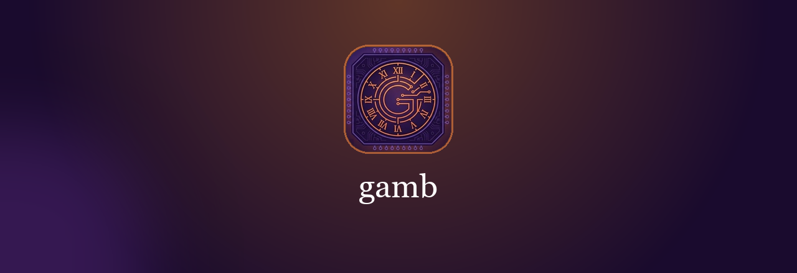

<p align="center">
  
</p>

<p align="center">
  SaaS de reservas pelo WhatsApp + Google Agenda<br/>
  <strong>MVP rodando:</strong> <a href="https://gamb.site">https://gamb.site</a>
  ·
  API: <a href="https://api.gamb.site">https://api.gamb.site</a>
</p>

---

# Smart Booking API (WhatsApp + Google Calendar)

Uma API em Spring Boot que funciona como o cérebro de um bot de WhatsApp: atende o cliente, consulta disponibilidade e gerencia reservas no Google Agenda.

O projeto evoluiu de um protótipo simples para uma arquitetura SaaS multi-tenant, permitindo atender diferentes negócios (locações, clínicas, barbearias) de forma simultânea e isolada. O painel do MVP está no ar em [gamb.site](https://gamb.site).

## Mudança de perspectiva de desenvolvimento

No começo a pergunta era só **“o Java sobe e o webhook responde?”**. Isso gerou um script que funcionava, mas com menu hardcoded, credenciais expostas e zero isolamento entre clientes.

A perspectiva mudou em camadas:

1. **De script para produto.** Cada empresa passou a ter sessão, agenda e módulos próprios. O bot deixou de ser um fluxo único e virou um SaaS.
2. **De “fazer funcionar” para contrato.** A fonte da verdade da API HTTP passou a ser a pasta `especificacao/` (OpenAPI). O Java cumpre o YAML; o front não consome entidade JPA.
3. **De infraestrutura para a pessoa do outro lado.** Com o MVP no ar, o gargalo deixou de ser só Docker/RAM. O texto do WhatsApp, a foto do espaço e o link da galeria no Drive passaram a ser parte do produto: o bot ensina o formato da data (`DD/MM/AAAA`), lembra que `0` volta ao menu e oferece a galeria completa sem travar a conversa.
4. **De painel só do admin para o cliente operar sozinho.** O MEI configura saudação, fotos (com prévia ao clicar na mini imagem) e o Drive opcional no próprio perfil, no mesmo padrão visual do painel master.

O diário técnico continua registrando a guerra de infra. Esta seção registra outra virada: **desenvolver olhando o usuário final**, sem soltar o contrato nem a arquitetura.

## Tecnologias

* **Backend:** Java, Spring Boot
* **Frontend:** Angular (painel em [gamb.site](https://gamb.site))
* **Banco de Dados:** PostgreSQL, Hibernate/JPA
* **Mensageria:** WhatsApp Web API (WPPConnect)
* **Infraestrutura:** Docker, Docker Compose, Vercel (front), VPS (API)

## Arquitetura e Padrões

Projeto estruturado com foco em Clean Architecture e princípios SOLID:
* **Strategy & Factory:** Roteamento dinâmico de atendimento baseado no ramo do cliente, permitindo escalar sem modificar o roteador principal.
* **Observer:** Processamento assíncrono para integração com o Google Agenda, evitando travamentos na comunicação com o usuário no WhatsApp.
* **Singleton:** Gerenciamento de instâncias na memória para otimizar performance e evitar leitura de disco desnecessária.
* **Contract-first:** Rotas e DTOs nascem no OpenAPI (`especificacao/`) e o Java se alinha a eles.

## Como Executar

1. Clone o repositório.
2. Adicione suas chaves de API na pasta `resources`.
3. Configure as credenciais do Google Agenda.
4. Execute o comando abaixo para iniciar a infraestrutura:

```bash
docker-compose up -d
```

Painel local do frontend: `cd frontend && npm start` → http://localhost:4200

## 📖 Diário de Engenharia

Para entender as decisões arquiteturais por trás deste projeto — como a resolução de vazamentos de memória no Docker (SIGTERM), otimizações de banco de dados (LazyInitializationException) e a migração de ambiente para ganho de performance — acesse a documentação técnica:

⚔️ [Ler o Diário de guerra](docs/diário_guerra.md)
